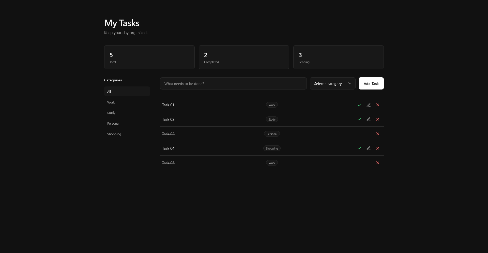

# Todo List

A simple and responsive Todo List built with **HTML, CSS and JavaScript**.

The app allows users to add, edit, complete and remove tasks, organize them by category, filter tasks, and persist their data in the browser using `localStorage`.

## Live Demo

🔗 **[View the live project](https://douglas-todo-list.vercel.app/)**

## Preview



## Features

* Add new tasks
* Edit existing tasks
* Mark tasks as completed
* Remove individual tasks
* Organize tasks by category
* Filter tasks by category
* Track total, completed and pending tasks
* Persist tasks using `localStorage`
* Responsive layout for mobile, tablet and desktop
* Accessible interface (keyboard focus, ARIA attributes, reduced motion)

### Categories

* Work
* Study
* Personal
* Shopping

## Technologies

* HTML5
* CSS3
* JavaScript
* LocalStorage
* SVG

No frameworks or external libraries were used.

## What I Practiced

This project was built to strengthen my JavaScript fundamentals while creating a practical and usable interface from scratch.

Some of the concepts I practiced include:

* DOM manipulation
* Event listeners
* Functions and callbacks
* Arrays and objects
* `find()` and `findIndex()`
* `filter()` and `map()`
* Form handling
* Conditional rendering
* Dynamic element creation
* `localStorage`
* JSON parsing and serialization
* Basic accessibility with ARIA attributes

## Responsive Design

The layout is mobile-first and adapts to different screen sizes.

On desktop (820px and above), the category filters are displayed in a sidebar next to the task list. On smaller screens, they move above the task list as horizontal buttons that scroll when they don't fit. The forms also adapt to the available space: fields and buttons wrap onto new rows instead of being squeezed.

The breakpoints were chosen based on where the content starts to break, not on common device sizes.

## Accessibility

Accessibility was considered throughout the interface, including:

* Semantic HTML elements
* Visible focus states for keyboard navigation
* `aria-label` attributes for task action buttons
* `aria-pressed` for category filters
* Screen-reader-only text for completed tasks
* Reduced-motion support

## Getting Started

No installation or build process is required.

Clone the repository:

```bash
git clone https://github.com/douglas-andre/todo-list.git
cd todo-list
```

Then open `index.html` in your browser.

## Project Structure

```text
todo-list/
├── index.html
├── style.css
├── script.js
├── favicon.png
└── assets/
    └── todo-list-preview.png
```

## Future Improvements

Some ideas for future versions:

* Replace `alert()` validation with inline error messages (using `aria-live`)
* Add task search
* Add due dates
* Add task priority

## About the Project

This project is part of my front-end development studies, built to practice JavaScript fundamentals through a real, usable interface.
